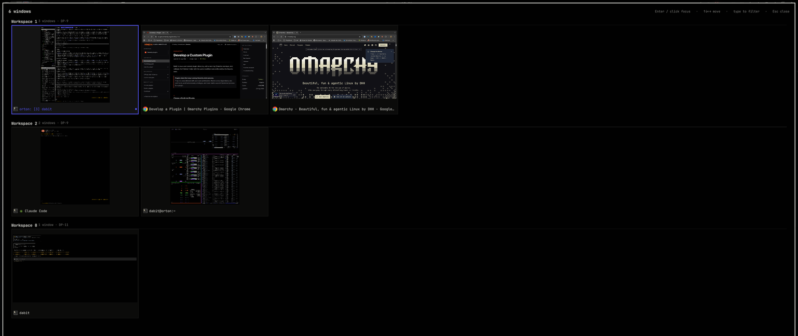

# Where The Foo (`io.github.dabit.wherethefoo`)

A fullscreen overlay showing **every open window on every workspace** as a grid
of live thumbnails, grouped by workspace. Click a tile — or arrow to it and
press Enter — to jump to that window's workspace and focus the window.



## Using it

| Input | Action |
|-------|--------|
| Click the bar icon | Open / close the overlay |
| your keybinding | Same, if you bind one ([how](#opening-it)) |
| Click a tile | Go to that workspace and focus that window |
| `←` `→` `Tab` | Move the selection |
| `↑` `↓` | Move a row |
| `Home` / `End` | First / last window |
| `Enter` | Focus the selected window |
| Type anything | Filter by window title, app, or workspace name |
| `Esc` | Clear the filter, or close the overlay |
| Click the backdrop | Close |

The overlay opens on whichever monitor Hyprland currently has focus on, and
starts with the focused window selected and scrolled into view. Special
workspaces (the scratchpad) are listed last.

## How the thumbnails work

Tiles are live captures via the Wayland screencopy protocol
(`ScreencopyView`), which Hyprland serves for windows on inactive workspaces
too. Nothing is screenshotted to disk and nothing is cached between summons —
the captures start when the overlay opens and stop when it closes. Each
capture is constrained to twice its on-screen tile size so a dozen live
captures stay cheap.

A window with no Wayland handle yet (or one that hasn't produced a frame)
shows its app icon on a flat placeholder instead.

## Requirements

- Omarchy 4 with the Quickshell-based `omarchy-shell` (plugin `schemaVersion: 1`).
- Hyprland, for the window/workspace model and the focus dispatch.

No other dependencies, no setup steps, no configuration file. The plugin adds
no packages and runs no external commands.

### Privileges and data

- **No network access.** Nothing is fetched, uploaded, or phoned home. Window
  titles and app names are rendered with `textFormat: Text.PlainText`, so a
  title containing markup cannot make Qt fetch a remote image and turn this
  into an outbound request.
- **No subprocesses.** Window focus goes over Hyprland's own IPC socket via
  `Hyprland.dispatch`, not through a shell.
- **No disk writes.** No cache, no state file, no screenshots saved anywhere.
- **Reads** the Hyprland window/workspace model, the desktop-entry database
  (for app icons), and live window content through the Wayland screencopy
  protocol — all of it already available to any plugin in the shell process.

Like every Omarchy plugin, this runs unsandboxed inside `omarchy-shell`.

## Files

```
manifest.json     plugin metadata — kinds "overlay" + "bar-widget"
WhereTheFoo.qml   the overlay: model, grid, keyboard handling, activation
BarWidget.qml     the bar entry that opens it
Layout.js         pure grid arithmetic and filtering (no QML dependencies)
preview.png       marketplace/README screenshot
LICENSE           MIT
```

## Install

```bash
omarchy plugin add https://github.com/dabit/wherethefoo.git --enable --yes
```

That clones the repo into `~/.config/omarchy/plugins/io.github.dabit.wherethefoo/`
and enables it. To install from a local checkout instead:

```bash
git clone ~/git/wherethefoo ~/.config/omarchy/plugins/io.github.dabit.wherethefoo
omarchy-shell shell rescanPlugins
omarchy plugin enable io.github.dabit.wherethefoo
```

The plugin folder must be a real directory — `omarchy plugin validate` refuses
a symlinked one, so a checkout that lives elsewhere gets cloned in rather than
linked in.

### Opening it

Enabling the plugin puts a grid icon in the bar — click it to open the
overlay. That works straight after install, with no configuration.

A keybinding is nicer for something you open constantly, but a plugin cannot
ship one: the manifest has no field for a keybinding, and Omarchy has no
command that writes bindings. So add it yourself in
`~/.config/hypr/bindings.lua`.

**Recommended:**

```lua
o.bind("SUPER + D", "Where The Foo", "omarchy-shell shell toggle io.github.dabit.wherethefoo '{}'")
```

`SUPER + D` is unbound in stock Omarchy, so nothing is displaced, and a plain
letter resolves the same way on every Latin keyboard layout. The letters free
in a stock install are `A B D E H I M N Q R U Y Z`. Apply with
`hyprctl reload` and confirm with `hyprctl configerrors`.

**If you want the Exposé-shaped chord**, `SUPER` + the key above Tab feels
right — but read the dead-key note below first, because the obvious spelling
silently does nothing on a lot of layouts:

```lua
o.bind("SUPER + GRAVE", "Where The Foo", "...")       -- plain layouts
o.bind("SUPER + dead_grave", "Where The Foo", "...")  -- us(intl) and friends
```

#### The dead-key trap

Hyprland binds a **keysym**, not a physical key. On `us(intl)` — and on most
European layouts — the key above Tab does not produce `grave`:

```
key <TLDE> { [ dead_grave, dead_tilde, grave, asciitilde ] };
```

`grave` sits on level 3, behind AltGr, so `SUPER + GRAVE` registers cleanly,
shows up in `hyprctl binds`, and can never match a keypress. Nothing errors;
the key is simply dead. Binding `dead_grave` instead makes the same physical
key work (confirmed on `us(intl)`). Check what your own layout emits before
binding a punctuation key:

```bash
xkbcli compile-keymap --layout "$(hyprctl devices -j | jq -r '.keyboards[0].layout')" \
  --variant "$(hyprctl devices -j | jq -r '.keyboards[0].variant')" | grep 'key <TLDE>'
```

Binding the physical key instead would dodge this, but **`code:NN` is not
available through `o.bind`** — Omarchy's `hl.bind` swallows `"SUPER + code:49"`
as a literal key name, reloading without error and binding nothing. Bind the
keysym your layout actually emits, or use a letter.

#### Chords that are already taken

Every Tab combination is spoken for: `SUPER+TAB` is "Next workspace",
`SUPER+SHIFT+TAB` "Previous workspace", `SUPER+CTRL+TAB` "Former workspace",
`SUPER+ALT+TAB` "Next window in group", and `SUPER+SHIFT+ALT+TAB` "Previous
window in group". Claiming one means `hl.unbind` first, and losing that action.

To check a chord before taking it, ask Hyprland's live bind table — the only
source that has your bindings and Omarchy's defaults together:

```bash
hyprctl binds | awk '/^bind/{mm="";k="";d=""} /modmask:/{mm=$2} /^\tkey:/{k=$2} \
  /description:/{sub(/^\tdescription: /,"");d=$0} /arg:/{if(k!="") print mm"\t"k"\t"d}' | sort -u
```

Modmask is a bitmask: SHIFT 1, CTRL 4, ALT 8, SUPER 64 — so `SUPER+ALT` is 72.

The toggle command also works from a terminal or any script, if you would
rather not bind a key at all.

## Verifying what you installed

`omarchy plugin add` clones the repository's default branch at the moment you
run it, so what lands on disk is whatever `main` pointed at then — not
necessarily the commit the marketplace validated. Check which one you got:

```bash
git -C ~/.config/omarchy/plugins/io.github.dabit.wherethefoo rev-parse HEAD
git -C ~/.config/omarchy/plugins/io.github.dabit.wherethefoo log --oneline -5
```

The marketplace records the commit it validated in the submission thread
([#9203](https://github.com/omacom/omarchy-plugin-marketplace/issues/9203)),
and `git log` here shows everything that has landed since.

`main` only ever carries code intended for release, and the branch is
protected against force-pushes and deletion, so a commit you have inspected
cannot be rewritten out from under you. You can pin to a specific commit or
tag with ordinary git — but note that a detached HEAD makes
`omarchy plugin update` fail, since it fast-forwards the checked-out branch.

Everything this plugin can do is listed under **Privileges and data** above.
Like every Omarchy plugin it runs unsandboxed, in the same process as the bar,
the lock screen and the polkit agent; marketplace approval is a listing
decision, not a security audit. Read the source — it is four files.

## Update

```bash
omarchy plugin update io.github.dabit.wherethefoo   # git-managed checkouts
omarchy restart shell                                # see "Hacking on it"
```

## Removal

```bash
omarchy plugin remove io.github.dabit.wherethefoo --yes
```

That disables the plugin, drops its entry from
`~/.config/omarchy/shell.json`, and deletes
`~/.config/omarchy/plugins/io.github.dabit.wherethefoo/`. Then remove the
`o.bind(..., "Where The Foo", ...)` line from `~/.config/hypr/bindings.lua`
and run `hyprctl reload`.

Nothing else is left behind: the plugin writes no files outside its own
directory and its `shell.json` entry.

## Hacking on it

The installed plugin is a git checkout, so the loop is edit here, commit, pull
there, restart:

```bash
git -C ~/git/wherethefoo commit -am "..."
git -C ~/.config/omarchy/plugins/io.github.dabit.wherethefoo pull
omarchy restart shell
```

**The restart is not optional.** Once the overlay has been summoned in a shell
session, edits to its QML do not take effect from a save or from
`omarchy-shell shell rescanPlugins` — the shell logs
`Local plugin changed, reloading: …` and keeps rendering the old code, and
`summon` still returns `ok`. Only `omarchy restart shell` applies the change.
The quickest way to tell "my change is wrong" from "my change is not running"
is to add a method and call it: `shell call <id> <method> ''` returns
`unknown` while the stale item is still mounted.

To check the computed grid without eyeballing it — useful when tuning tile
sizes on a display you can't see:

```bash
omarchy-shell shell summon io.github.dabit.wherethefoo '{}'
omarchy-shell shell call io.github.dabit.wherethefoo metrics ''
# {"screen":"DP-9","usingLua":true,"gridWidth":3006,"tileWidth":490,"columns":6,...}
omarchy-shell shell hide io.github.dabit.wherethefoo
```

### Tuning

All in `WhereTheFoo.qml`, near the top:

- `minTileWidth` / `maxTileWidth` / `targetColumns` — tile size. Tiles grow
  with the window until `maxTileWidth`, so wide displays get bigger
  thumbnails rather than more columns.
- `thumbHeight` — the thumbnail box height, currently `tileWidth * 0.62`.
  Captures are letterboxed inside it at the window's own aspect ratio.

### Activation

Focusing a window also switches to its workspace, so a single dispatch does
both. Hyprland's Lua config (Omarchy 4) rejects the bare
`dispatch focuswindow address:0x…` form, so the plugin branches on
`Hyprland.usingLua` and sends `hl.dsp.focus({ window = "address:0x…" })`
instead, falling back to `focuswindow` on a non-Lua setup.

**Addresses need normalising.** Quickshell reports a toplevel address without
the `0x` prefix (`5e119bc7f6a0`); Hyprland's `address:` selector and `hyprctl`
use the prefixed form. A guard that assumes the prefixed form rejects every
real click while passing every test written against `hyprctl` output.

**The dispatch has to come after the overlay is gone, on a timer.** Dismissing
a layer surface that holds exclusive keyboard focus makes Hyprland
re-evaluate focus, and that fallback runs late enough to override a dispatch
issued before it. The symptom is specific and misleading: you land on the
right workspace with the wrong window focused. Seconds of delay do not help —
the fallback fires on unmap, whenever that is — so the order has to be
dismiss, wait for the unmap to settle, then focus.

That in turn is why `manifest.json` sets `keepLoaded: true`. Without it the
host deactivates this plugin's Loader on hide and destroys the item, taking
the pending timer with it, and nothing is dispatched at all. Every
first-party overlay (clipboard, emojis, image-picker, reminders, menu) sets
the same flag.
